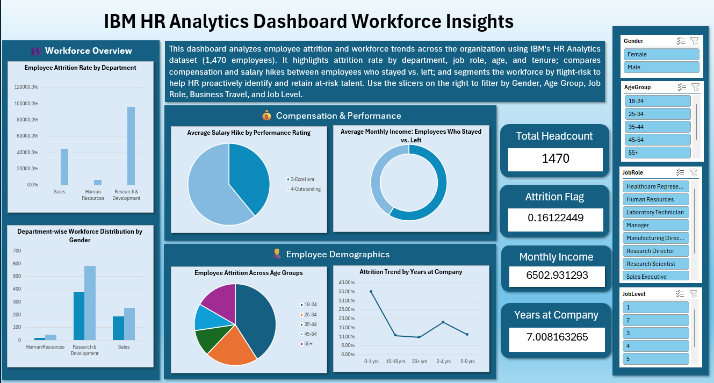

# 👥 IBM HR Analytics Dashboard – Employee Attrition & Workforce Insights

## 📌 Project Overview

The **IBM HR Analytics Dashboard** is an interactive Microsoft Excel dashboard developed to analyze employee attrition and workforce trends using IBM's HR Analytics dataset containing **1,470 employee records**.

The dashboard provides insights into employee demographics, attrition patterns, compensation, performance, and workforce distribution, enabling HR teams and business leaders to identify key retention challenges and support data-driven decision-making.

---

## 🎯 Business Objective

Employee attrition is one of the biggest challenges organizations face. This dashboard aims to answer critical HR questions such as:

- Which departments experience the highest employee attrition?
- Does working overtime increase the likelihood of attrition?
- Are employees leaving due to lower compensation?
- Which age groups have the highest attrition?
- Is work-life balance associated with employee turnover?
- How does tenure influence attrition?
- Which employees are considered high flight-risk?

---

## 📊 Dashboard Preview

---

## 🛠️ Tools Used

- Microsoft Excel
- Pivot Tables
- Pivot Charts
- Slicers
- Conditional Formatting
- Excel Tables
- Helper Columns
- KPI Cards
- Business Analysis

---

## 📁 Dataset

**Dataset:** IBM HR Analytics Employee Attrition & Performance

- Employees: **1,470**
- Domain: Human Resources
- Source: IBM HR Analytics (Kaggle)

---

## 🧹 Data Cleaning

The following preprocessing steps were performed before analysis:

- Removed duplicate records
- Checked for missing values
- Converted data into an Excel Table
- Standardized data formats
- Validated categorical fields
- Applied appropriate number formatting
- Created helper columns for analysis

### Helper Columns Created

- Attrition Count
- Age Group
- Tenure Group
- Distance Band
- Flight Risk Score
- Flight Risk Category

---

## 📈 Dashboard KPIs

- 👥 Total Headcount
- 📉 Attrition Rate
- 💰 Average Monthly Income
- 📅 Average Years at Company

---

## 📊 Dashboard Sections

### 👥 Workforce Overview

- Employee Attrition Rate by Department
- Department-wise Workforce Distribution by Gender

---

### 💰 Compensation & Performance

- Average Salary Hike by Performance Rating
- Average Monthly Income (Stayed vs Left)

---

### 👨‍💼 Employee Demographics

- Employee Attrition Across Age Groups
- Attrition Trend by Years at Company

---

## 📌 Business Questions Answered

- What is the overall employee attrition rate?
- Which departments have the highest attrition?
- Which job roles experience the highest employee turnover?
- Does overtime contribute to higher attrition?
- How does monthly income differ between employees who stayed and those who left?
- Which age groups are more likely to resign?
- Does employee tenure impact attrition?
- Are top performers receiving competitive salary hikes?
- Which employees represent the highest flight risk?

---

## 📈 Key Insights

- Research & Development has the largest workforce and experiences the highest number of employee exits.
- Employees working overtime show a significantly higher attrition rate.
- Employees who left the organization have a lower average monthly income compared to retained employees.
- The highest attrition is observed among employees aged **25–34 years**.
- Attrition is highest during the early years of employment, indicating onboarding and retention challenges.
- Employees with lower work-life balance and job satisfaction are more likely to leave.
- Salary hikes show limited variation across performance ratings, suggesting opportunities to better reward high performers.

---

## 💡 Business Recommendations

- Reduce excessive overtime through better workforce planning.
- Strengthen employee engagement during the first few years of employment.
- Review compensation strategies for high-performing employees.
- Implement targeted retention programs for high-risk departments and job roles.
- Improve career progression and promotion opportunities.
- Monitor employees with multiple flight-risk indicators through proactive HR interventions.

---

## 📚 Excel Skills Demonstrated

- Data Cleaning
- Data Validation
- Excel Tables
- Pivot Tables
- Pivot Charts
- KPI Design
- Interactive Slicers
- Conditional Formatting
- Business Storytelling
- Dashboard Design

---

## 🚀 Project Outcome

This project demonstrates the complete workflow of an HR data analyst—from data cleaning and transformation to interactive dashboard development and business insight generation.

It showcases practical Excel skills commonly used by HR Analysts, Business Analysts, and Data Analysts in enterprise environments and serves as a portfolio-ready project for entry-level Data Analytics roles.

---

## ⭐ If you found this project useful, feel free to star the repository.
