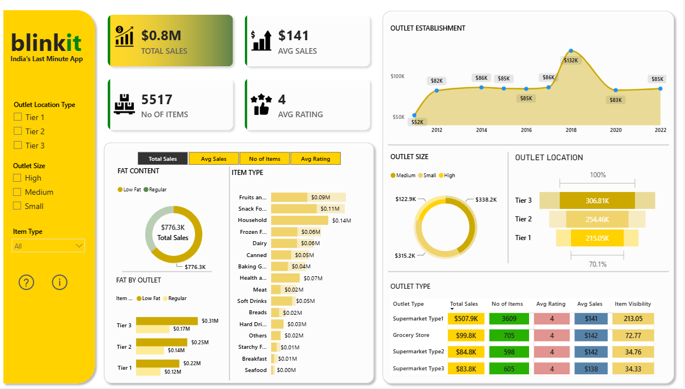

# 🛒 Blinkit Grocery Sales & Outlet Analytics Dashboard

## 📊 Project Overview

An interactive **Power BI dashboard** built to analyze Blinkit's grocery sales performance, outlet characteristics, customer ratings, and product distribution.

The project focuses on identifying key business insights related to **sales performance, item performance, outlet location, outlet size, outlet type, fat content, and customer ratings** through interactive KPIs and visualizations.

The dashboard was developed based on defined business requirements and granular analytical requirements using **Microsoft Power BI**.

---

## 🎯 Business Objective

To conduct a comprehensive analysis of Blinkit's:

- Sales performance
- Customer satisfaction
- Product and item performance
- Inventory distribution
- Outlet characteristics

The goal is to identify **key insights and opportunities for business optimization** using KPIs and interactive visualizations.

---

## 📌 Key Performance Indicators (KPIs)

The dashboard tracks the following primary KPIs:

| KPI | Description |
|---|---|
| 💰 Total Sales | Overall revenue generated from all items sold |
| 📈 Average Sales | Average revenue per sale |
| 📦 Number of Items | Total count of different items sold |
| ⭐ Average Rating | Average customer rating for items sold |

---

## 📈 Dashboard Highlights

The dashboard provides an executive-level view of Blinkit's performance through:

- KPI cards for key business metrics
- Sales trend analysis
- Fat content analysis
- Item type performance
- Outlet size analysis
- Outlet location comparison
- Outlet type performance
- Interactive filters for outlet characteristics

### Dashboard Preview



---

## 🗂️ Dataset

The project uses a **Blinkit Grocery Sales dataset** containing **8,523 records** and 12 attributes.

---

## 🛠️ Tools & Technologies

- **Microsoft Power BI** – Dashboard development and data visualization
- **Power Query** – Data cleaning and transformation
- **DAX** – KPI and measure calculations
- **Microsoft Excel** – Dataset
- **GitHub** – Project documentation and version control

---

## 🔄 Project Workflow

```text
Raw Dataset
     ↓
Data Cleaning & Transformation
     ↓
Data Modeling
     ↓
DAX Measures & KPIs
     ↓
Interactive Visualizations
     ↓
Business Analysis
     ↓
Power BI Dashboard
